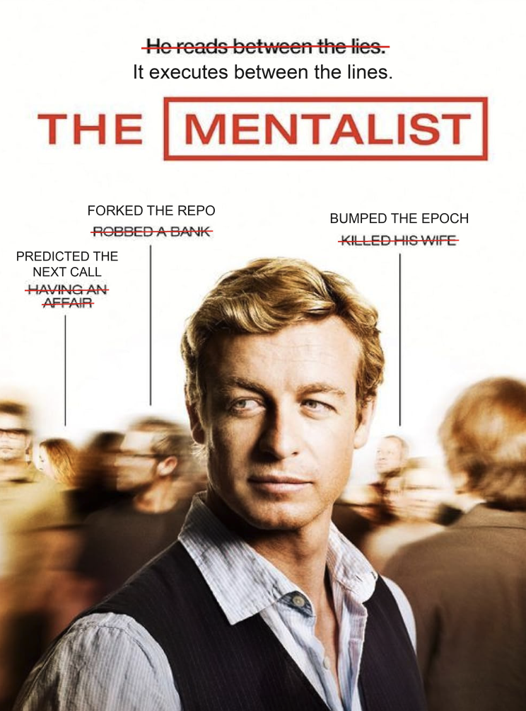

<h1 align="center">Stateful Speculative Tool Calling</h1>

  

A research prototype for overlapping an agent's tool calls, including isolated
writes, with the model still thinking. Like speculative decoding, it does work
ahead of demand, but speculates over tool execution and repository state rather
than tokens. It builds on my earlier project [SPEX](https://github.com/sofiabod/spex).

I believe that a token stream is not the only signal for speculation. An edit landing or a tool
returning tells us something about what comes next, even before the next call
has been written. SFX (or as I call... "The Mentalist") uses those environment events to begin predicting
and executing a follow up before the model generates any of that call's tokens.

This led me to ask a more ambitious question: what would a framework that begins
speculatively executing a tool call and saving its output before a single token
of that call exists look like? Would mutating state in a forked copy, with strict
validation checks, break anything or provide a meaningful reduction in latency?

*Work in progress, shared publicly for feedback and ideas. CPU tests exercise the
mechanism and its correctness guards; live e2e latency gains remain unproven.*

## Architecture

- **Daemon:** receives completed tool calls and complete streamed edits through adapters.
- **Predictor:** combines mined priors with session history; a resolver supplies exact arguments.
- **Fork:** applies supported edits to copy-on-write repository copies and executes eligible continuations there.
- **Cache:** checks exact calls, invocation identity and tracked state before reusing results. Real edits remain authoritative; forks are discarded.

The implementation retains the name `sfx`.
